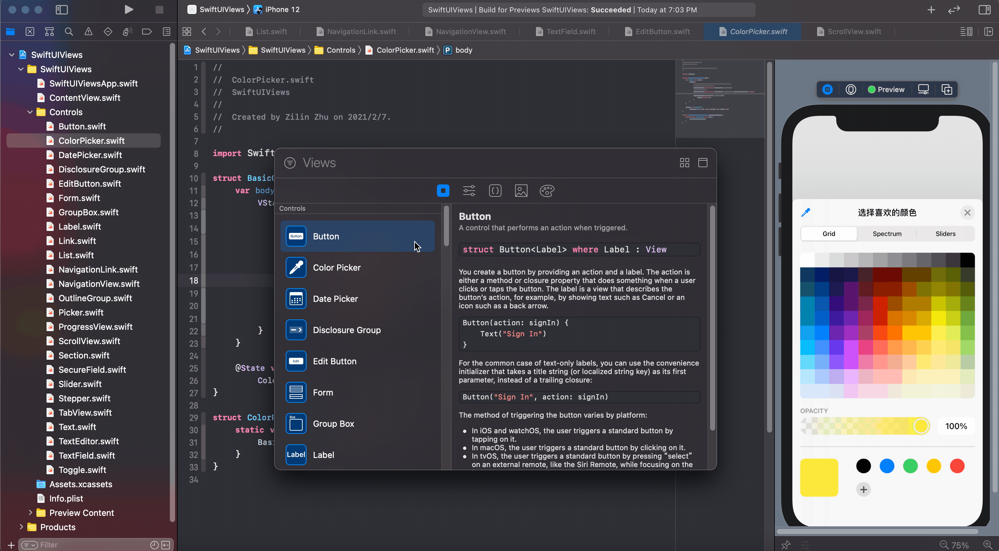
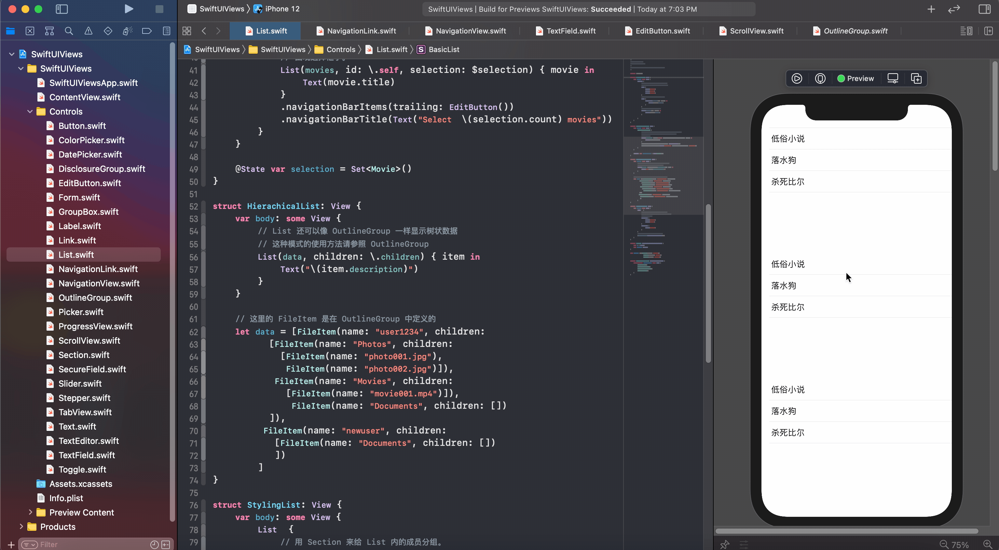

# SwiftUI 全部视图文档用例及解释

>  想学习 SwiftUI 但是英文文档读得头大？开发项目不知道 SwiftUI 的就能完成任务，还是需要回头用 UIKit？好像在某些地方看到过一个控件的用法，但是怎么也记不起来了？想解决这些问题，你就找对地方了！

本项目基于 SwiftUI 官方文档实例，对所有的 SwiftUI 控件视图的用例进行了总结。在 `Controls` 文件夹中，针对目前所有的 25 个控件的常规用法进行了总结。

  

对于每个控件，我们都尽量提供全面的用例，同时配合中文注释。同时，配合 SwiftUI 的预览功能，你可以一边看代码，一边对照到动态效果。

  

## Contributing

欢迎大家纠正项目中可能出现的纰漏和问题，也欢迎大家补充控件的新用法~ 让我们一起把这个项目变得更加完善！

## TODO

支持所有布局视图及其他视图的用例。

---

如果本项目给你带来了方便，不妨点个 star 再走~ 如果 README 中的图片无法加载，可能是因为 github 中的图片被墙了。你也可以看看这篇[掘金博文](https://juejin.cn/post/6926711998461935623)了解相关的信息。
